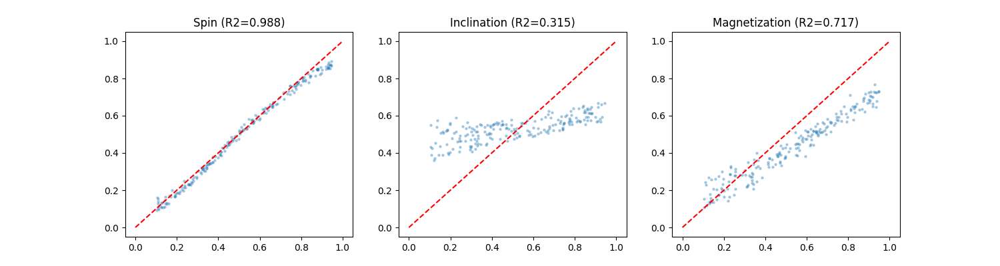

# Multi-Scale Adaptive Neural Network for Black Hole Parameter Regression

 
## Project Overview
This repository contains the source code and experimental results for my independent research project on applying deep learning to astrophysics. The goal is to infer physical parameters of black holes (spin, inclination, and magnetization) directly from synthetic black hole shadow images.

This work is designed for high school research competitions (e.g., Regeneron STS) and serves as a foundational step toward real-time Event Horizon Telescope (EHT) data analysis.

## Methodology
The core of this framework is the **Multi-Scale Adaptive Network (MANet)**. Unlike standard CNNs, MANet uses three parallel convolutional branches with different kernel sizes to capture distinct physical structures:
*   **3x3 kernels**: Local plasma turbulence.
*   **5x5 kernels**: Photon ring structure.
*   **7x7 kernels**: Global Doppler asymmetry.

## Key Results
*   **Spin (a*)**: Achieved \(R^2 = 0.988\)
*   **Magnetization (\beta)**: Achieved \(R^2 = 0.717\)
*   **Inclination (i)**: Achieved \(R^2 = 0.315\) (due to intrinsic parameter degeneracy)
*   **Robustness**: The model retains an \(R^2\) of 0.360 even under high observational noise (\(\sigma=0.3\)), outperforming baseline single-scale CNNs (which dropped to \(R^2=0.21\) for inclination).

## Reference
*   Chollet, F. (2019). On the Measure of Intelligence. arXiv:1911.01547.
*   Event Horizon Telescope Collaboration (2019). First M87 Event Horizon Telescope Results. I. The Shadow of the Supermassive Black Hole.
    [paper PDF](BlackHole_AI_Research.pdf)
## Full Paper
*Author: Alfira Mukat*
